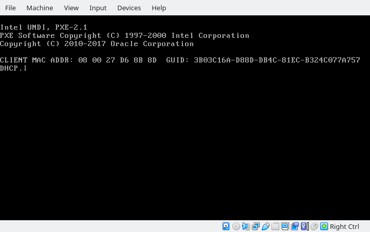

## Short Script for convert UUID to GUID for use in VirtualBox
Since VirtualBox Version 6.1.0 (released December 10 2019) the UUID ist stored as Little Endian
https://www.virtualbox.org/wiki/Changelog-6.1
This is done for with the Windows 10 Digital Lizence. 
During the boot up the internal the GUID (BIG-Endigan Version) is shown. 


The UUID is defined in RFC4122. PXE needs the network byte order for adressing the machine.
These UUID is used for identification of the machine under pxelinux.cfg/
For example the machine  (given by ```$ vboxmanage list vms```)
```
"PXE Test" {6ac1033b-8dd8-4cdb-81ec-b324c077a757}
```
needs to be representend as 
```
pxelinux.cfg/3b03c16a-d88d-db4c-81ec-b324c077a757
```